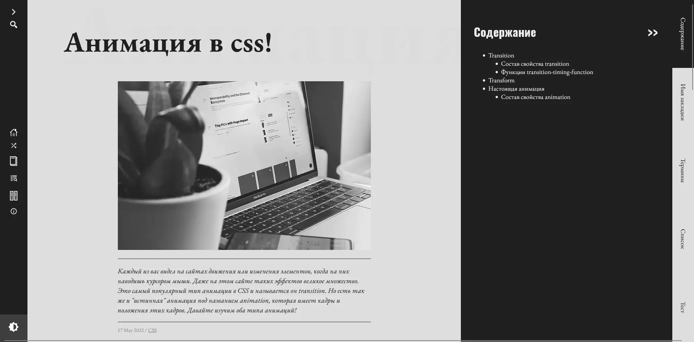

# CONSPECTUS

📰 блог для личных целей

 

<!-- ccылка на проект -->

>⚠️**ВНИМАНИЕ!** ⚠️ Пожалуйста, не скачивайте код, не распространяйте и не изменяйте его. Несмотря на то, что это мой личный проект, мне хотелось выложить его код в публичный доступ для показа своих возможностей. 

## Что это?

Это небольшой сайт-блог на nuxt.js созданный с двумя целями: создать свой блог разработчика и изучить nuxt.js. 

**Год разработки**: 2022 год

### 💡 Идея проекта
У меня сохранилось множество "конспектов", оставшихся с момента учебы в универе, провышения квалификации через онлайн-курсы и просто интересное от статей и руководств в интернете, найденных в процессе работы. Искать в этих конспектах не особо удобно, информация не структурирована и не визуализированна. Так возникла идея перетащить свои txt в html. А после возникла идея создать целый блог для этих целей.

🌱*UPGRADE*🌱 Недвано я нашла notion (советую!) и перенесла свои конспекты туда, так что на сайте скорее будут только те статьи, что написанны для публики.

### ✒️ История создания проекта
В процессе разработки было множество изменений. Для начала разработка была чисто в html файлах с css в style теге. Потом появился node сервер. Появилась идея создать полноценный сайт и был разработан дизайн, план и архитектура проекта. Из-за этого добавлен vue.js. А следом добавились vue-cli и vue-router для удобства разработки. В процессе разработки было принято решение перейти на nuxt.js, так как эта технология для меня была новой и неизведанной. А после увеличения сайта принято решение создать БД для хранения информации. БД так же была выбрана с учетом отсутствия достаточного опыта работы с PostgreSQL. 

### 🔎 Почему был выложен этот проект?

1. Во первых, это мой первый серьезный pet-проект. Самый долгостройный и самый крутой в плане реализации.
2. Во вторых, репрозиторий выложен в публичный доступ для показа своих возможностей будущим работодателям и всем интересующимся
2. В третьих, репрозиторий создан для истории. По коду в проекте можно понять, какой стиль кода был у меня в 2022 году.

## Технологии 
- Дизайн разрабатывался в Miro. Сайт проверялся через Lighthouse. 
- В проекте использовался Nuxt.js
- К Nuxt.js всегда идет vue.js, в том числе были использованны vue-router, vue-social-sharing
- Стиль писался с использованием препроцессора SCSS
- Для передачи сообщений использовался axios
- БД на PostgreSQL

## Требования
- npm v8.12.1
- node >= 16.15.1
- Поддерживает все современные браузеры
- Проект запускался на windows с использованием программы visual studio

## Установка
Режим разработчика
1. `npm install`
2. `npm run dev`

Production режим

1. `npm install`
2. `npm run build`
3. `npm run start`

## TODO
- [ ] Добавить ссылку на свое портфолио
- [ ] Развернуть сайт на хостинге
- [ ] Написать пару статей
